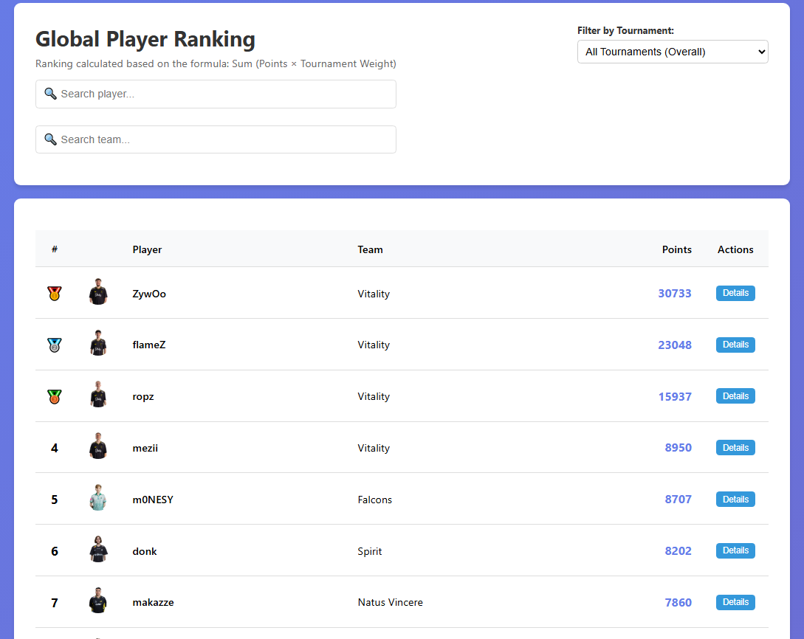
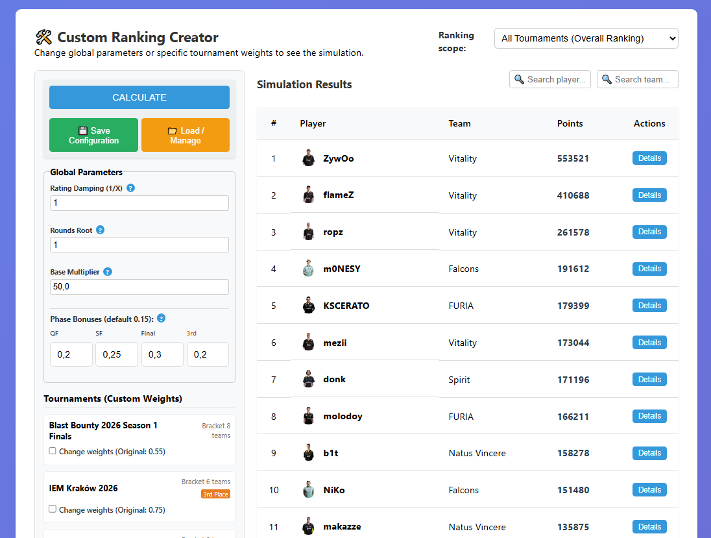
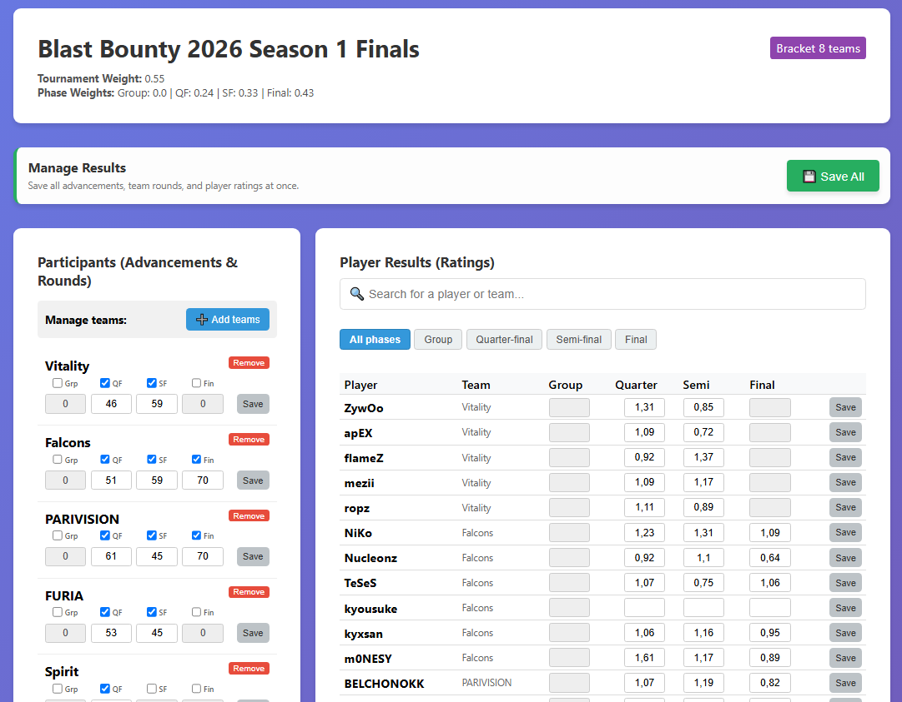
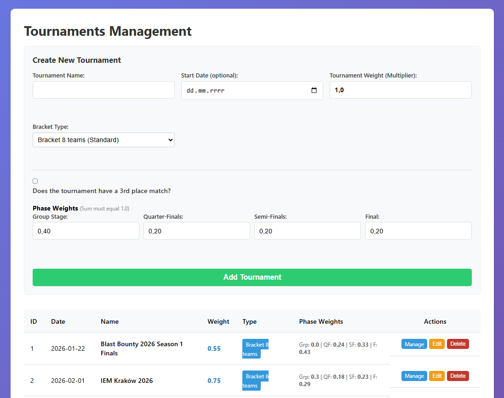
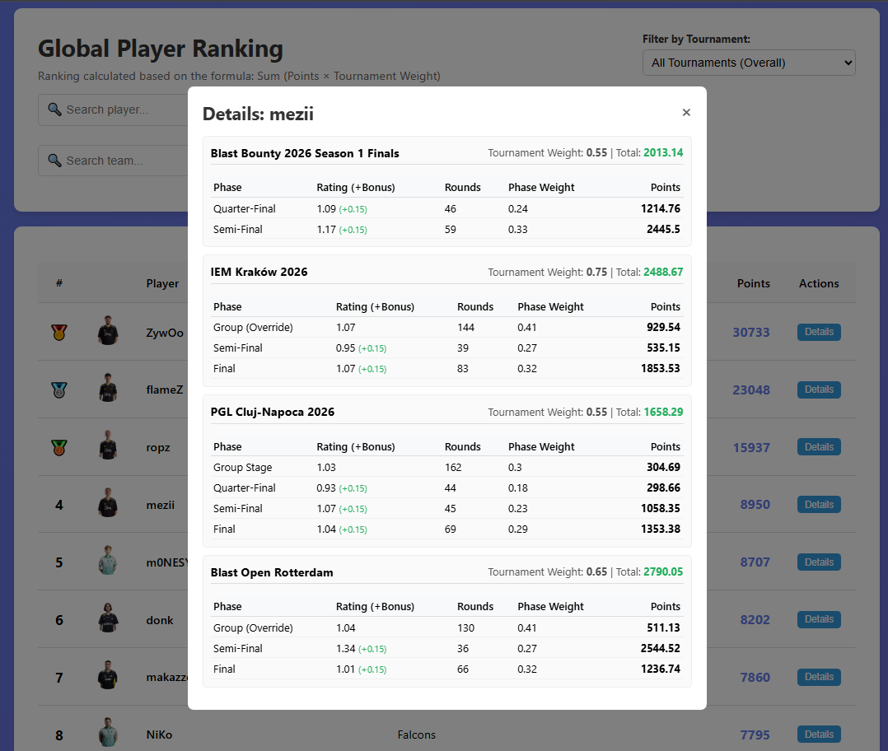
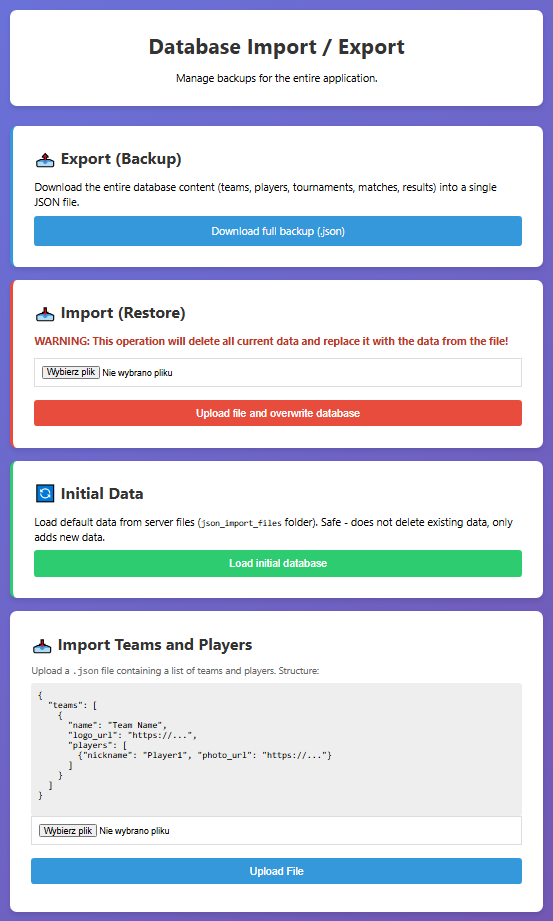

# 🎯 CS2 Player Tracker


**Live Demo:** https://cs2-players-tracker.onrender.com/

**CS2 Player Tracker** is a comprehensive, full-stack web application designed to collect, process, and analyze Counter-Strike 2 player performances across custom tournaments. It features a sophisticated, dynamic ranking algorithm that evaluates players based on their match ratings, tournament prestige, and bracket progression.

## ✨ Key Features

- **🏆 Dynamic Global Ranking:** Calculates player standings using a custom mathematical model combining HLTV 2.0 ratings, phase bonuses, rounds multipliers, and individual tournament weights.
- **🧪 Custom Ranking Simulator:** An interactive sandbox allowing users to tweak core algorithm variables such as rating damping, rounds root, and base multipliers and instantly see the simulated impact on the global leaderboard.
- **⚙️ Tournament Management:** Complete administrative control over tournament creation, supporting varying bracket types (8-team, 6-team, 16-team), phase weights, and third-place matches.
- **👥 Player & Team Database:** Full CRUD (Create, Read, Update, Delete) capabilities for teams and players.
- **🔄 Data Portability:** Built-in JSON import/export functionality for complete database backups, restores, and initial data seeding.
- **🔌 Real-Time Status:** WebSocket integration for live server status and latency monitoring.

## 📸 Screenshots

*A visual overview of the application's core modules.*

### Global Player Ranking



### Custom Ranking Creator (Algorithm Sandbox)



### Tournament Management & Results Input



### Tournament Configuration



### Player Points Drill-Down



### Database Management



## 🛠️ Technology Stack

- **Backend:** Python 3.12+, FastAPI
- **Database:** SQLite, SQLAlchemy 2.0 (ORM)
- **Data Validation:** Pydantic
- **Frontend:** HTML5, CSS3, Vanilla JavaScript, Jinja2 Templates
- **Testing:** Pytest (Unit & Integration tests)
- **Server:** Uvicorn
- **Code Quality:** Black (Formatter)

## 🚀 Installation & Setup

Ensure you have Python 3.12+ installed on your machine.

### 1. Clone the repository

```bash
git clone https://github.com/jLidak/cs2-players-tracker.git
cd cs2-player-tracker
```

### 2. Create and activate a virtual environment

**Windows:**

```bash
python -m venv venv
.\venv\Scripts\activate
```

**macOS/Linux:**

```bash
python3 -m venv venv
source venv/bin/activate
```

### 3. Install dependencies

```bash
pip install -r requirements.txt
```

### 4. Run the development server

```bash
uvicorn main:app --reload
```

The application will be available at:

**http://127.0.0.1:8000**

## 🧪 Testing & Code Quality

The project includes a comprehensive test suite to ensure API and business logic stability.

### Run tests

```bash
pytest test_all.py
```

### Format the code

To maintain high code quality and strict PEP 8 compliance, the project uses the `black` formatter:

```bash
black .
```

## 📁 Project Architecture

The application follows a modular, scalable architecture utilizing FastAPI routers to enforce a clean separation of concerns:

```text
cs2_player_tracker/
├── json_import_files/      # JSON files for initial DB seeding (import)
├── routers/                # API endpoint logic divided by domain
│   ├── data_ops.py         # Import/Export and mass operations
│   ├── matches.py          # Match handling and ratings logic
│   ├── players.py          # Player CRUD and search
│   ├── ranking.py          # Core ranking calculation algorithms
│   ├── teams.py            # Team CRUD
│   ├── tournaments.py      # Tournament CRUD and configuration
│   ├── views.py            # HTML template rendering (Jinja2)
│   └── websocket.py        # WebSocket server status handling
├── static/                 # Static assets (CSS, Favicon)
├── templates/              # Jinja2 HTML templates
├── database.py             # SQLAlchemy DB connection & session config
├── main.py                 # FastAPI application entry point
├── models.py               # SQLAlchemy ORM models
├── schemas.py              # Pydantic schemas for data validation
└── test_all.py             # Unit and integration tests
```

## 👨‍💻 Author

**Jakub Lidak**

- [GitHub](https://github.com/jLidak)
- [LinkedIn](https://linkedin.com/in/jakub-lidak)
